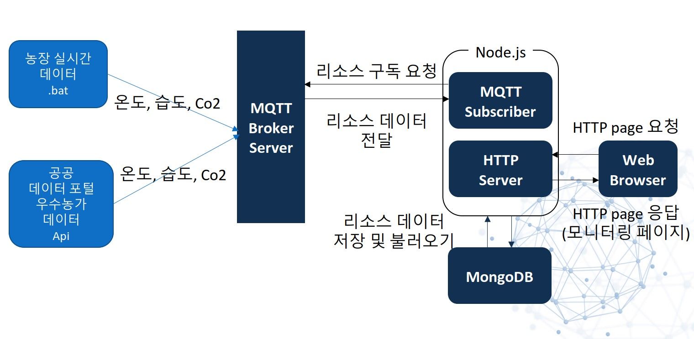
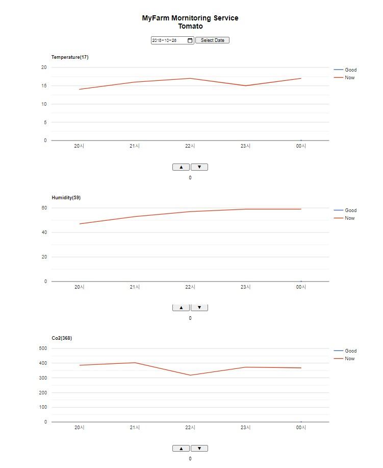
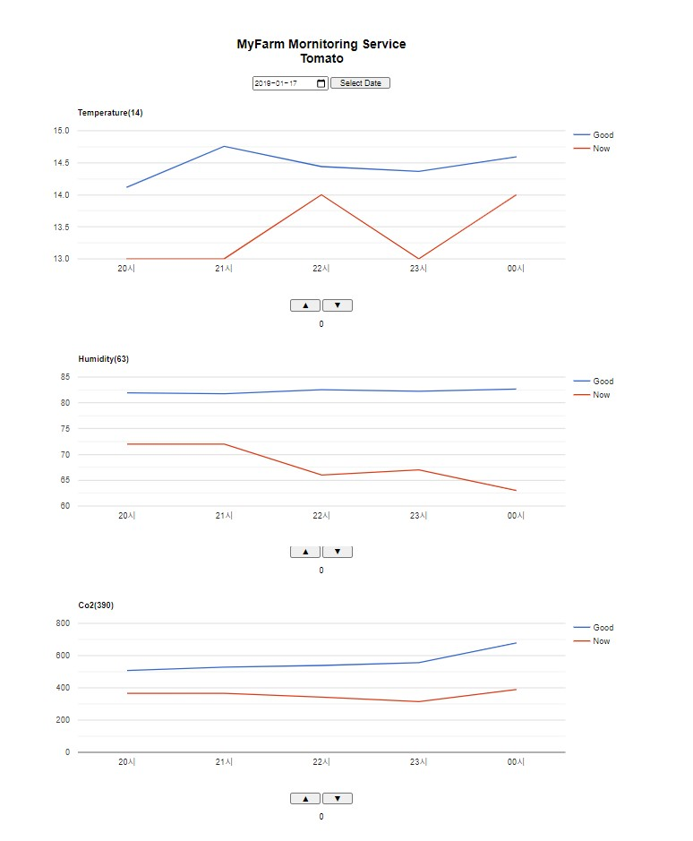

# SmartFarm_Management_Web
## (가상) 스마트팜 농장 관리 웹
#### Team Member : 박건형
#### Project Period : 2021/05/18 ~ 2021/06/07

----

## 프로젝트 개요
자신이 스마트팜을 운영하는 농장주 라고 가정합니다. 농장의 온도,습도,Co2 상태를 모니터링 하여 그래프로 나타내고 우수농가 데이터와 자신의 농장 데이터를 한눈에 비교 할 수 있도록 하여 자신의 농장의 상태를 조절 할 수 있도록 하는 웹 입니다. (가상의 시나리오 입니다.)

## 다이어그램
> 농장 실시간 데이터.bat(tmp.bat)은 가상 센서 역할을 합니다.(일정 범위에서 랜덤 값을 생성합니다.)

## 프로젝트 실행화면

초기화면

> 실시간으로 자신의 농장 데이터만 받는 화면

데이터를 받은 후 화면

> 우수농가 데이터를 받은 직후 화면(select data 버튼 클릭)

데이터를 변화 시킨 이후

> 데이터를 조절한후 모습 그래프만 보았을때 큰 차이는 없는 것 처럼보이지만 
그래프에 직접 마우스를 올려보면 값이 변한 것을 볼 수 있습니다.

